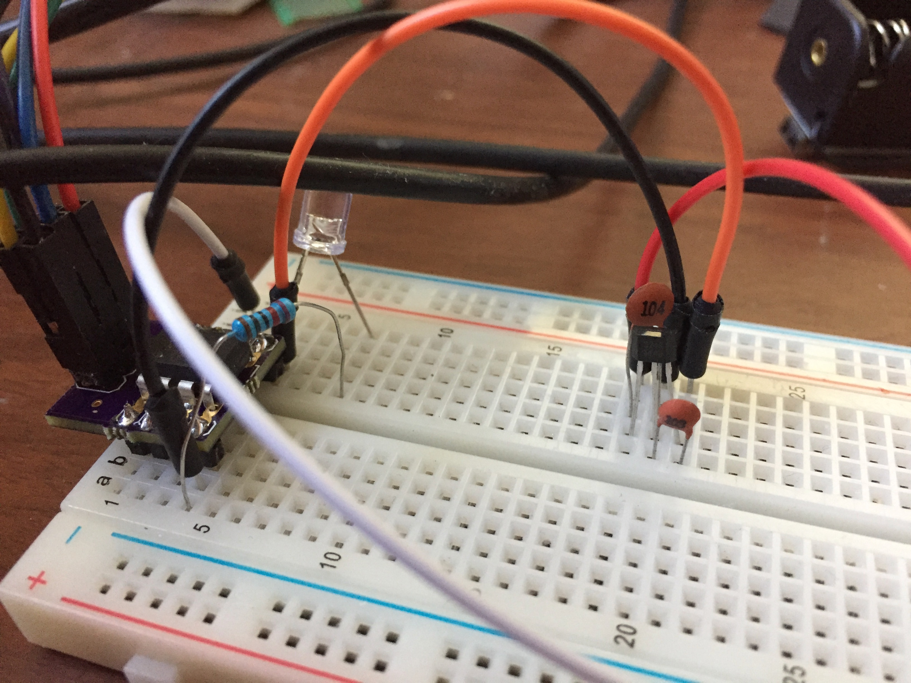
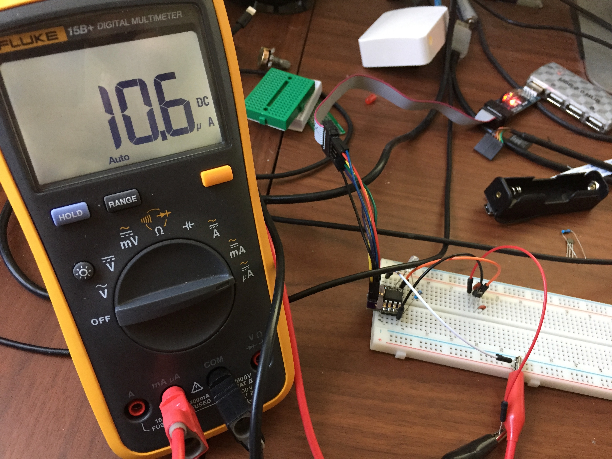
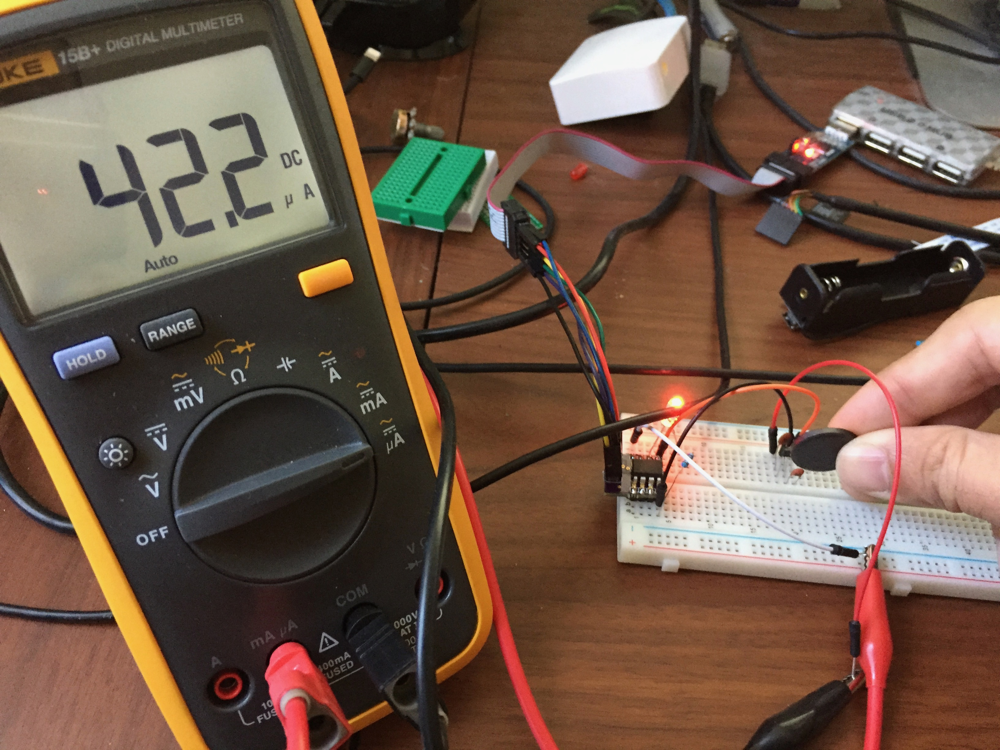
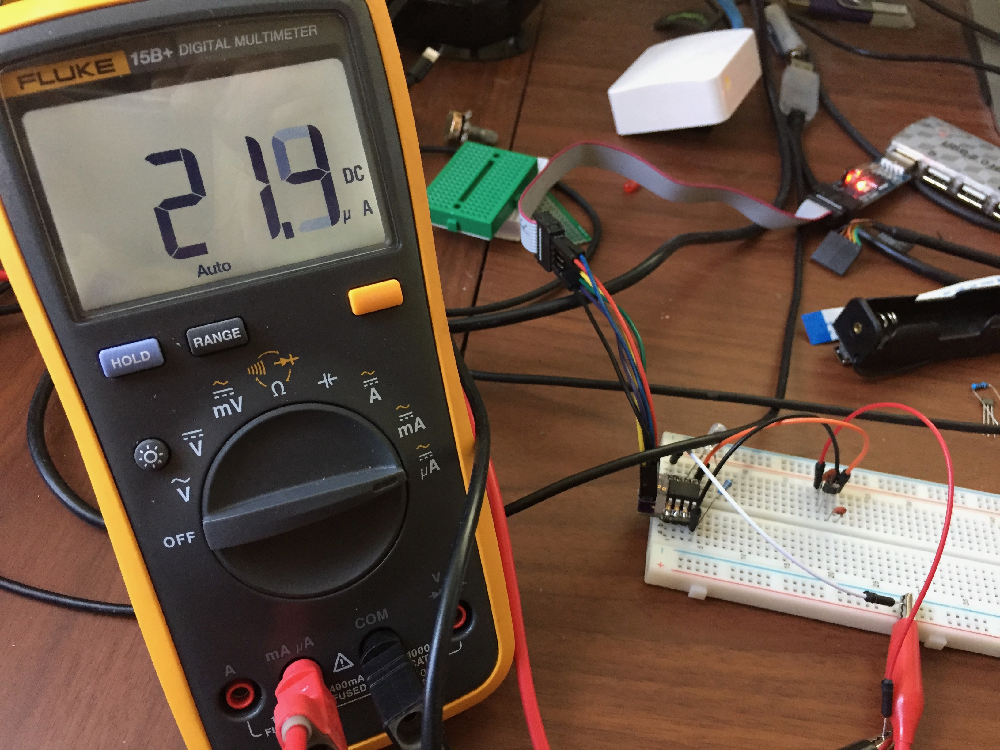

# ATTiny85 w/AH9246 omnipolar hall effect sensor

### Description

Measuring the current consumption of the AH9246 at 3.3V and 5V.

Active High 3.3V (no magnet):

Low 3.3V (magnet):

Active High 5V (no magnet):

Low 5V (magnet):

